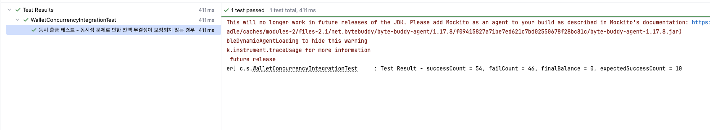
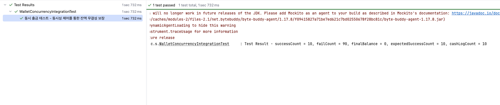
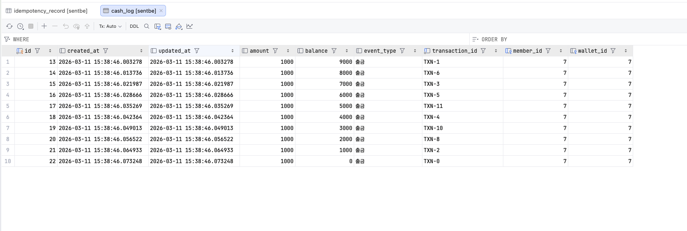
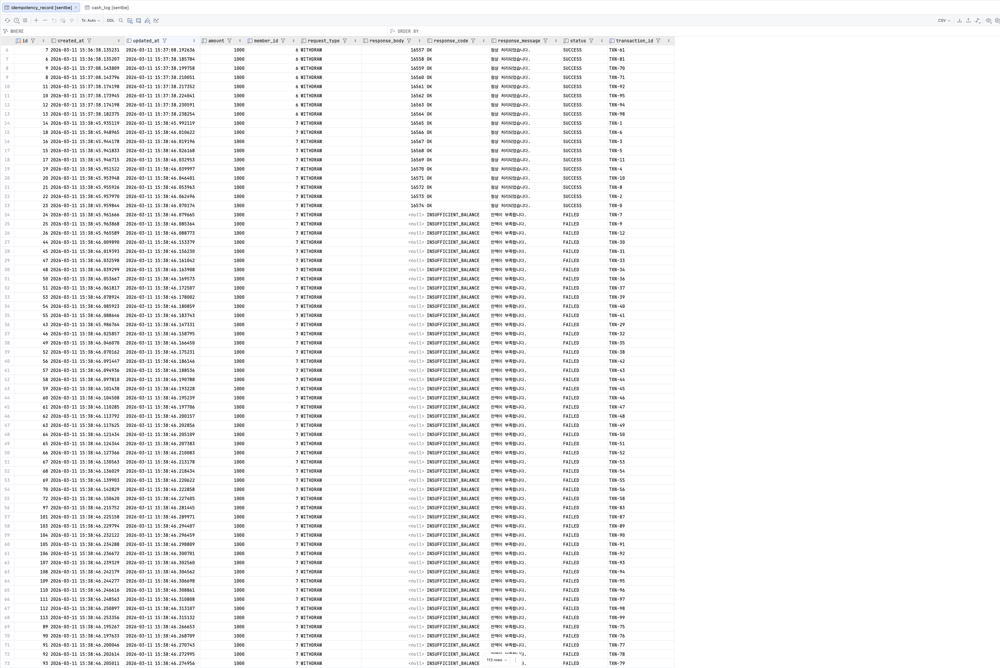

# 월렛 출금 동시성 문제

## 개요
동일한 walletId 하나를 대상으로 다수의 스레드가 동시에 출금 요청을 보낼 때 발생하는 동시성 문제애 대한 설명입니다.

## 문제 상황
* walletId: 1개
* balance: 10,000원
* 시나리오: 100개의 서로 다른 요청이 동시에 각각 1,000원씩 출금 시도

### 예상 결과
* balance: 0원
* successCount: 10건
* failCount: 90건

### 실제 결과
* balance: 0원
* successCount 10건 초과 (54건)
* failCount 90건 미만 (46건)

## 동시성 문제 발생 원인
* race condition
    * 다수의 스레드가 동시에 같은 데이터를 읽고 처리하려고 하여 순서에 따라 결과가 달라짐
* lost update
    * race condition으로 인해 여러 업데이트 중 일부가 덮어씌워져 update 유실

### 핵심 문제점
* 읽기 단계: 여러 스레드가 동시에 같은 balance 값(10,000)을 읽음
* 계산 단계: 각 스레드가 메모리에서 독립적으로 계산하고 동시에 통과 (10,000 - 1,000 = 9,000) (Race Condition)
* 쓰기 단계: 동시에 수행된 update가 서로 덮어쓰게 되어 이전 update 유실 (Lost Update)

## 해결 방법: Pessimistic Lock 사용

###  wallet 조회 시 비관적 락 사용
```java
public interface WalletRepository extends JpaRepository<Wallet, Long> {

  Optional<Wallet> findByMemberId(Long memberId);

  @Lock(LockModeType.PESSIMISTIC_WRITE)
  @Query("""
        select w
        from Wallet w
        where w.id = :walletId
    """)
  Optional<Wallet> findByIdForUpdate(@Param("walletId") Long walletId);
}
```

### PESSIMISTIC_WRITE Lock의 효과

- 한 스레드가 조회하면 다른 스레드는 **대기**
- 순차적으로 처리되어 모든 입금이 **누적**됨

## 테스트 코드

### 동시성 제어 적용 전 요청 처리 무결성 불일치 검증 테스트
```java
@Test
@DisplayName("동시 출금 테스트 - 동시성 문제로 인한 성공 횟수 무결성 불일치 검증")
void concurrentWithdraw_withoutConcurrencyControl() throws Exception {
    // given
    // 100개의 서로 다른 스레드로 각각 1,000원씩 동시 출금 요청
    
    // when
    // Lock 적용 전 withdraw 진행
    
    // then
    // 성공 횟수가 10건 이상 조회됨 (동시성 문제 발생)
    assertThat(successCount.get()).isGreaterThanOrEqualTo((int) expectedSuccessCount);
}
```

* 테스트 결과



### 비관적 락 적용 후 잔액 무결성 보장 검증 테스트
```java
@Test
@DisplayName("동시 출금 테스트 - 동시성 문제로 인한 성공 횟수 무결성 보장)
void concurrentWithdraw_withConcurrencyControl() throws Exception {
    // given
    // 100개의 서로 다른 스레드로 각각 1,000원씩 동시 출금 요청
    
    // when
    // 비관적 Lock 적용 후 withdraw 진행
    
    // then
    // 성공 횟수가 10건 조회되고 나머지 90건은 실패처리 (동시성 문제 해결)
    assertThat(successCount.get()).isEqualTo(expectedSuccessCount);
}
```

* 테스트 결과
  
  * 정확히 10건의 데이터만 `insert`
    
  * 10건 데이터 `SUCCESS` 처리 이후 나머지 90건 데이터는 `FAILED` 처리
    

## 우려 사항
### 1. 비관적 락의 성능 이슈
비관적 락의 경우 다음과 같은 성능 저하 가능성 존재
* 대기 시간 증가: 여러 요청이 동시에 들어올 경우 요청이 순차적으로 처리되기 때문에 처리 지연 발생 가능
* 락 경합: 특정 wallet에 요청이 집중될 경우 DB row lock 대기 발생
* DB 부하 증가: lock이 길게 유지되면 트랜잭션 대기 증가, 커넥션 점유 시간 증가

## 향후 대책
### 1. 대용량 환경 대응 - Redis 분산 락 도입
* DB lock 경합 감소
  * DB lock 대신 redis를 통해 lock을 관리하면 DB row lock 경쟁을 줄일 수 있음
  * DB가 lock 관리에서 해방되기 때문에 DB 부하 감소 효과 발생
* 처리 성능 향상
  * Redis는 in-memory 기반 시스템이기 때문에 lock 획득 속도가 매우 빠르므로 고트래픽 환경에서 처리량을 높일 수 있음
* 확장성
  * 단일 DB 인스턴스에 의존하는 DB 기반 lock에 비해 redis는 여러 서버 환경에서도 lock을 공유할 수 있어 수평 확장에 용이


## 참고 파일
* [WalletConcurrencyIntegrationTest.java](../src/test/java/com/sentbe/WalletConcurrencyIntegrationTest.java)
* [WalletRepository.java](../src/main/java/com/sentbe/cash/out/WalletRepository.java)